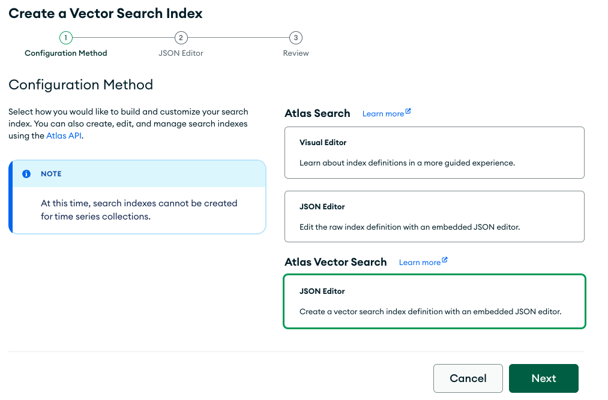
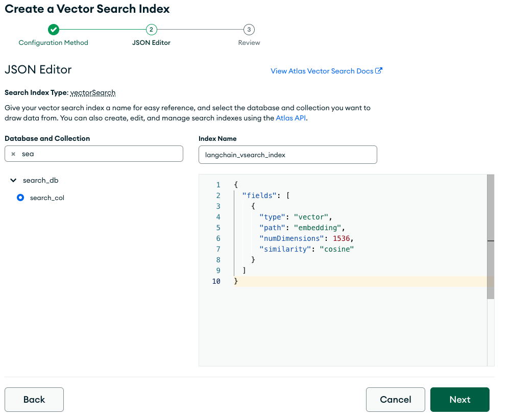

# Semantic Search Made Easy With LangChain and MongoDB

Enabling semantic search on user-specific data is a multi-step process that includes loading, transforming, embedding and storing data before it can be queried. 


That graphic is from the team over at [LangChain](https://python.langchain.com/docs/modules/data_connection/), whose goal is to provide a set of utilities to greatly simplify this process. 

In this tutorial, we'll walk through each of these steps, using MongoDB Atlas as our Store.

## Prerequisites
* [MongoDB Atlas Subscription](https://cloud.mongodb.com/) (Free Tier is fine)
* Open AI [API key](https://platform.openai.com/account/api-keys)
```zsh
pip install -r requirements.txt
```

## Load -> Transform -> Embed -> Store 
### Step 1: Load
There's no lacking for sources of data: Slack, YouTube, Git, Excel, Reddit, Twitter, etc., and [LangChain provides a growing list](https://python.langchain.com/docs/modules/data_connection/document_loaders/) of integrations that includes this list and many more.

For this exercise, we're going to use the [WebBaseLoader](https://python.langchain.com/docs/modules/data_connection/document_loaders/integrations/web_base) to load the [Wikipedia page for AT&T](https://en.wikipedia.org/wiki/AT%26T). 

```python
from langchain.document_loaders import WebBaseLoader
loader = WebBaseLoader("https://en.wikipedia.org/wiki/AT%26T")
data = loader.load()
```

 ### Step 2: Transform (Split)
 Now that we have a bunch of text loaded, it needs to be split into smaller chunks so we can tease out the relevant portion based on our search query. For this example we'll use the recommended [RecursiveCharacterTextSplitter](https://python.langchain.com/docs/modules/data_connection/document_transformers/text_splitters/recursive_text_splitter). As I have it configured, it attempts to split on paragraphs (`"\n\n"`), then sentences(`"(?<=\. )"`), then words (`" "`) using a chunk size of 1000 characters. So if a paragraph doesn't fit into 1000 characters, it will truncate at the next word it can fit to keep the chunk size under 1000 chacters. You can tune the `chunk_size` to your liking. Smaller numbers will lead to more documents, and vice-versa.

```python
from langchain.text_splitter import RecursiveCharacterTextSplitter
text_splitter = RecursiveCharacterTextSplitter(chunk_size=1000, chunk_overlap=0, separators=[
                                               "\n\n", "\n", "(?<=\. )", " "], length_function=len)
docs = text_splitter.split_documents(data)
```

### Step 3: Embed
[Embedding](https://python.langchain.com/docs/modules/data_connection/text_embedding/) is where you associate your text with an LLM to create a vector representation of that text. There are many options to choose from, such as [OpenAI](https://openai.com/}) and [Hugging Face](https://huggingface.co/), and LangChang provides a standard interface for interacting with all of them. 

For this exercise we're going to use the popular [OpenAI embedding](https://python.langchain.com/docs/modules/data_connection/text_embedding/integrations/openai). Before proceeding, you'll need an [API key](https://platform.openai.com/account/api-keys) for the OpenAI platform, which you will set in [params.py](params.py).

We're simply going to load the embedder in this step. The real power comes when we store the embeddings in Step 4. 

```python
from langchain.embeddings.openai import OpenAIEmbeddings
embeddings = OpenAIEmbeddings(openai_api_key=params.openai_api_key)
```

### Step 4: Store
You'll need a vector database to store the embeddings, and lucky for you MongoDB fits that bill. Even luckier for you, the folks at LangChain have a [MongoDB Atlas](https://python.langchain.com/docs/modules/data_connection/vectorstores/integrations/mongodb_atlas) module that will do all the heavy lifting for you! Don't forget to add your MongoDB Atlas connection string to [params.py](params.py).

```python
from pymongo import MongoClient
from langchain.vectorstores import MongoDBAtlasVectorSearch

client = MongoClient(params.mongodb_conn_string)
collection = client[params.db_name][params.collection_name]

# Insert the documents in MongoDB Atlas with their embedding
docsearch = MongoDBAtlasVectorSearch.from_documents(
    docs, embeddings, collection=collection, index_name=index_name
)
```

You'll find the complete script in [vectorize.py](vectorize.py), which needs to be run once per data source (and you could easily modify the code to iterate over multiple data sources).

```zsh
python3 vectorize.py
```

### Step 5: Index the Vector Embeddings
The final step before we can query the data is to create a [search index on the stored embeddings](https://www.mongodb.com/docs/atlas/atlas-search/field-types/knn-vector/). 

In the Atlas console, create a Search Index using the JSON Editor named `vsearch_index` with the following definition: 
```JSON
{
  "mappings": {
    "dynamic": true,
    "fields": {
      "embedding": {
        "dimensions": 1536,
        "similarity": "cosine",
        "type": "knnVector"
      }
    }
  }
}
```






## Query 
Now that are source of data has been vectorized and indexed, we can begin our semantic search. LangChain lends an assist here too, with their [similirity_search](https://api.python.langchain.com/en/latest/vectorstores/langchain.vectorstores.mongodb_atlas.MongoDBAtlasVectorSearch.html?highlight=atlas#langchain.vectorstores.mongodb_atlas.MongoDBAtlasVectorSearch.similarity_search) method.  

```python
import params
from pymongo import MongoClient
from langchain.vectorstores import MongoDBAtlasVectorSearch
from langchain.embeddings.openai import OpenAIEmbeddings

# Initialize MongoDB python client
client = MongoClient(params.mongodb_conn_string)
collection = client[params.db_name][params.collection_name]

# Initialize the vector store
vectorStore = MongoDBAtlasVectorSearch(
    collection, OpenAIEmbeddings(openai_api_key=params.openai_api_key), index_name=params.index_name
)

# perform a similarity search between the embedding of the query and the embeddings of the documents
query = "How big is AT&T?"
docs = vectorStore.similarity_search(query)

print(docs[0].page_content)
```

```zsh
python3 query.py -q "How big is AT&T?"

Your question:
--------------
How big is AT&T?

AIs answer:
-------------
AT&T Inc. is an American multinational telecommunications holding company headquartered at Whitacre Tower in Downtown Dallas, Texas.[5] It is the world's third-largest telecommunications company by revenue and the third-largest provider of mobile telephone services in the U.S.[6][7] As of 2023[update], AT&T was ranked 13th on the Fortune 500 rankings of the largest United States corporations, with revenues of $120.7 billion.[8]
```